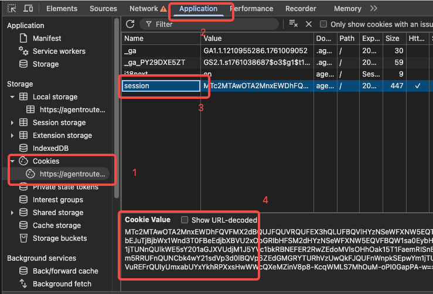
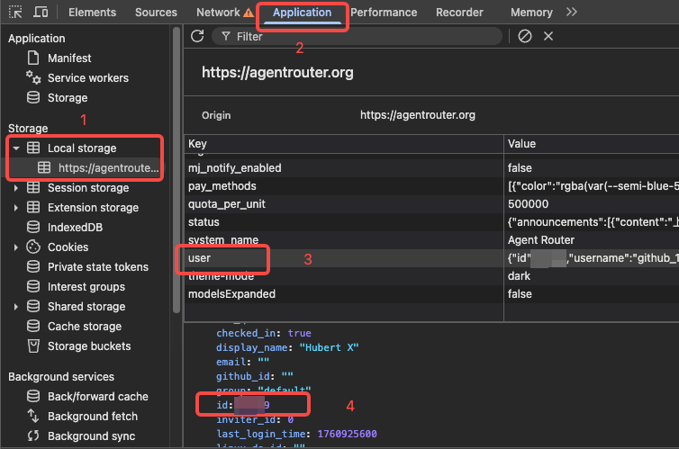
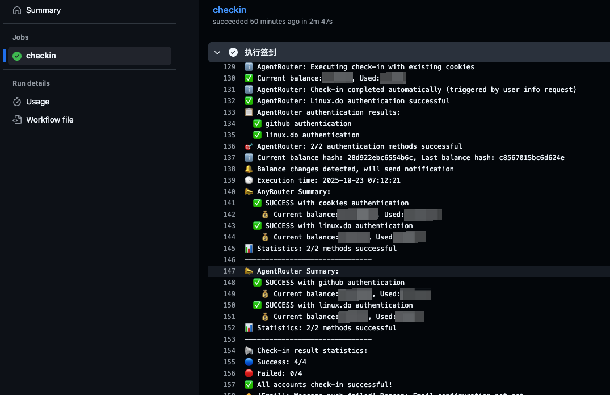

# newapi.ai 多账号自动签到

> Fork from [anyrouter-check-in](https://github.com/millylee/anyrouter-check-in)，添加 linux.do/github 登录时签到，支持更多场景

用于 Claude Code 中转站 newapi.ai 多账号每日签到。  
[AnyRouter 限时注册](https://anyrouter.top/register?aff=wJrb)即送 200 美金（推荐额外赠送 100 美金），每日签到赠送 $25。业界良心，支持 `claude-sonnet-4.5`、`gpt-5-codex`，Claude Code 百万上下文（使用 `/model sonnet[1m]` 开启），`gemini-2.5-pro` 模型。  
[AgentRouter 限时注册](https://agentrouter.org/register?aff=wDU2)即送 200 美金（推荐额外赠送 100 美金），每日签到赠送 $25。支持 `claude-sonnet-4.5`、`gpt-5`、`deepseek-v3.2`、`glm4.6`。  
其它使用 `newapi.ai` 功能相似

## 功能特性

- ✅ 单个/多账号自动签到
- ✅ 多种机器人通知（可选）
- ✅ linux.do 登录认证
- ✅ github 登录认证

## 使用方法

### 1. Fork 本仓库

点击右上角的 "Fork" 按钮，将本仓库 fork 到你的账户。

### 2. 设置 GitHub Environment Secret

1. 在你 fork 的仓库中，点击 "Settings" 选项卡
2. 在左侧菜单中找到 "Environments" -> "New environment"
3. 新建一个名为 `production` 的环境
4. 点击新建的 `production` 环境进入环境配置页
5. 点击 "Add environment secret" 创建 secret：
   - Name: `ACCOUNTS`
   - Value: 你的多账号配置数据

### 3. 多账号配置格式

支持单个与多个账号配置，可选 `name` 字段用于自定义账号显示名称：

```json
[
    {
      "name": "我的账号",
      "cookies": {
        "session": "account1_session_value"
      },
      "api_user": "account1_api_user_id"
      "github": {
        "username": "myuser",
        "password": "mypass",
      }
    },
    {
      "name": "另一个账号",
      "provider": "agentrouter",
      "linux.do": {
        "username": "user2",
        "password": "pass2",       
      }
    }
  ]
```

**字段说明**：
- `name` (可选)：自定义账号显示名称，用于通知和日志中标识账号
- `provider` (可选)：供应商，内置 `anyrouter`、`agentrouter`, 默认使用 `anyrouter`
- `cookies`(可选)：用于身份验证的 cookies 数据
- `api_user`(cookies 设置时必需)：用于请求头的 new-api-user 参数
- `linux.do`(可选)：用于登录身份验证
  * `username`: 用户名
  * `password`: 密码
- `github`(可选)：用于登录身份验证
  * `username`: 用户名
  * `password`: 密码

> 如果未提供 `name` 字段，会使用 `Account 1`、`Account 2` 等默认名称。  
> 配置中 `cookies`、`github`、`linux.do` 必须至少配置1个。  
> 可通过`PROVIDERS`环境添加自定义供应商


#### 如何获取 cookies 与 api_user 的值。

通过 F12 工具，切到 Application 面板，Cookies -> session 的值，最好重新登录下，但有可能提前失效，失效后报 401 错误，到时请再重新获取。



通过 F12 工具，切到 Application 面板，面板，Local storage -> user 对象中的id字段。



### 4. 启用 GitHub Actions

1. 在你的仓库中，点击 "Actions" 选项卡
2. 如果提示启用 Actions，请点击启用
3. 找到 "newapi.ai 自动签到" workflow
4. 点击 "Enable workflow"

### 5. 测试运行

你可以手动触发一次签到来测试：

1. 在 "Actions" 选项卡中，点击 "newapi.ai 自动签到"
2. 点击 "Run workflow" 按钮
3. 确认运行



## 执行时间

- 脚本每6小时执行一次（1. action 无法准确触发，基本延时 1~1.5h；2. 目前观测到 newapi.ai 的签到是每 24h 而不是零点就可签到）
- 你也可以随时手动触发签到

## 注意事项

- 可以在 Actions 页面查看详细的运行日志
- 支持部分账号失败，只要有账号成功签到，整个任务就不会失败

## 开启通知

脚本支持多种通知方式，可以通过配置以下环境变量开启，如果 `webhook` 有要求安全设置，例如钉钉，可以在新建机器人时选择自定义关键词，填写 `newapi.ai`。

### 邮箱通知
- `EMAIL_USER`: 发件人邮箱地址
- `EMAIL_PASS`: 发件人邮箱密码/授权码
- `CUSTOM_SMTP_SERVER`: 自定义发件人SMTP服务器(可选)
- `EMAIL_TO`: 收件人邮箱地址
### 钉钉机器人
- `DINGDING_WEBHOOK`: 钉钉机器人的 Webhook 地址

### 飞书机器人
- `FEISHU_WEBHOOK`: 飞书机器人的 Webhook 地址

### 企业微信机器人
- `WEIXIN_WEBHOOK`: 企业微信机器人的 Webhook 地址

### PushPlus 推送
- `PUSHPLUS_TOKEN`: PushPlus 的 Token

### Server酱
- `SERVERPUSHKEY`: Server酱的 SendKey

配置步骤：
1. 在仓库的 Settings -> Environments -> production -> Environment secrets 中添加上述环境变量
2. 每个通知方式都是独立的，可以只配置你需要的推送方式
3. 如果某个通知方式配置不正确或未配置，脚本会自动跳过该通知方式

## 故障排除

如果签到失败，请检查：

1. 账号配置格式是否正确
2. 网站是否更改了签到接口
3. 查看 Actions 运行日志获取详细错误信息

## 本地开发环境设置

如果你需要在本地测试或开发，请按照以下步骤设置：

```bash
# 安装所有依赖
uv sync --dev

# 安装 Playwright 浏览器
playwright install chromium

# 按 .env.example 创建 .env
uv run main.py
```

## 测试

```bash
uv sync --dev

# 安装 Playwright 浏览器
playwright install chromium

# 运行测试
uv run pytest tests/
```

## 免责声明

本脚本仅用于学习和研究目的，使用前请确保遵守相关网站的使用条款.
